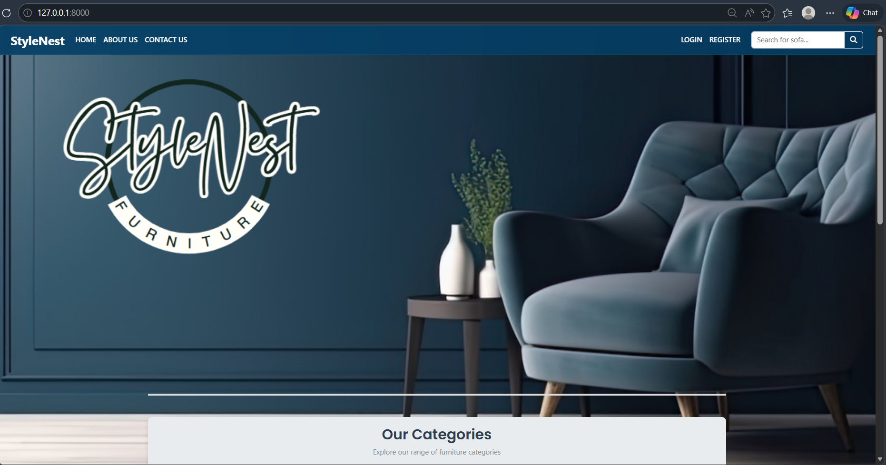
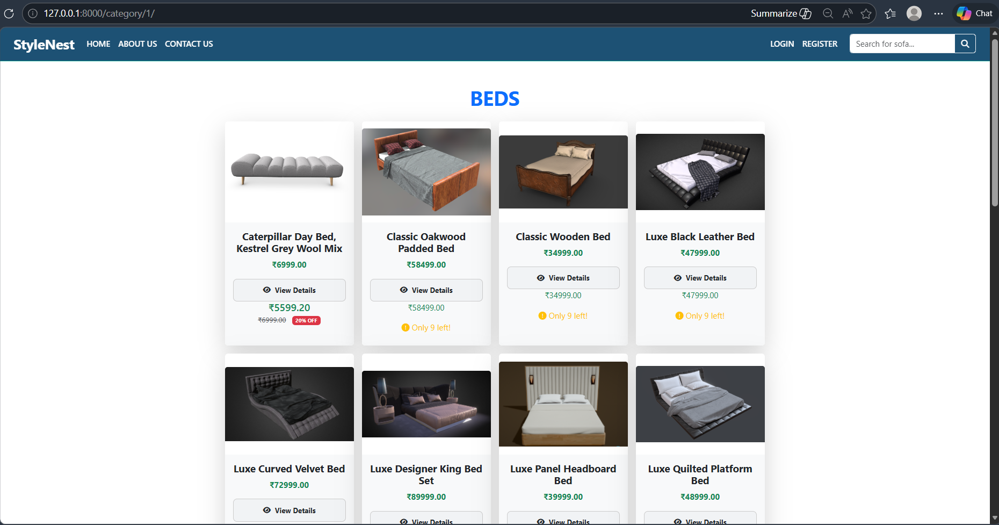
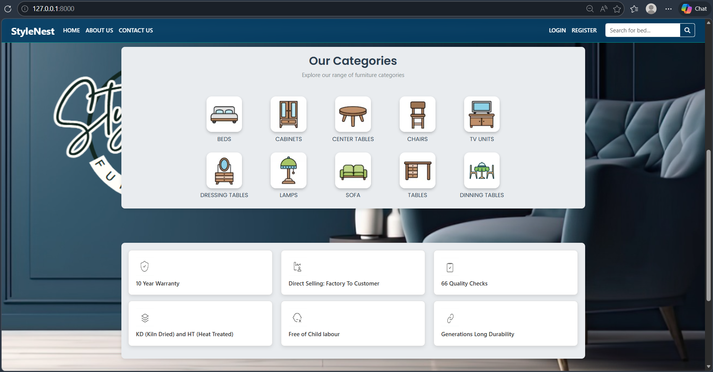

# Django Furniture & Sales Inventory System

A web-based furniture inventory and sales management system built using Django.  
This system helps manage furniture products, track inventory, and organize sales efficiently.

---

## Features

- Add, update, and delete furniture products
- Track product inventory
- Manage furniture sales
- Admin panel for product management
- Upload product images
- Organized product listing

---

## Tech Stack

- Python
- Django
- HTML
- CSS
- Bootstrap
- SQLite

---

## Project Structure

```
django-furniture-and-sales-inventory
│
├── furniture_shop/
├── store/
├── manage.py
├── .gitignore
└── README.md
```

---

## Installation

Clone the repository:

```
git clone https://github.com/sakshiipatel26/django-furniture-and-sales-inventory.git
```

Go to the project directory:

```
cd django-furniture-and-sales-inventory
```

Install dependencies:

```
pip install -r requirements.txt
```

Run migrations:

```
python manage.py migrate
```

Start the development server:

```
python manage.py runserver
```

Open in browser:

```
http://127.0.0.1:8000/
```

---
## Project Screenshots

### Home Page


### Product List


### Product Details


### Categories


### Admin Panel


## Author

**Sakshi Patel**  
MCA Student | Python & Django Developer  

GitHub:  
https://github.com/sakshiipatel26
